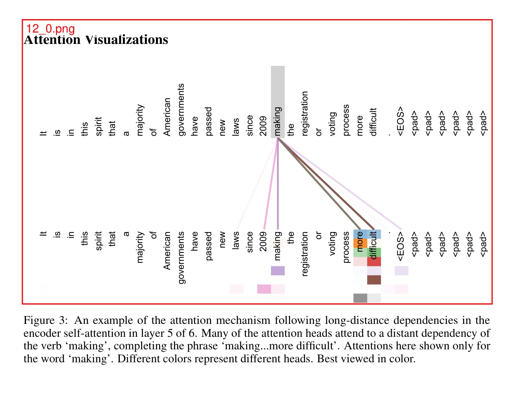

# gptpdf

<p align="center">
<a href="README_CN.md"></a>
<a href="README.md"></a>
</p>

Using VLLM (like GPT-4o) to parse PDF into markdown.

Our method can almost perfectly parse typesetting, mathematical formulas, tables, pictures, charts, etc.

Average price per page: $0.013

This package use [GeneralAgent](https://github.com/CosmosShadow/GeneralAgent) lib to interact with OpenAI API.


## Process steps

1. Use the PyMuPDF library to parse the PDF and extract all non-text areas.

2. Convert all non-text areas on the PDF into images and number them

3. Mark the non-text areas and numbers on each page of the PDF and save them as images, similar to the following:



4. Based on the image in step 3, use a large visual model (such as GPT-4o) to parse and obtain the markdown content.


## DEMO

See [examples/attention_is_all_you_need/output.md](examples/attention_is_all_you_need/output.md) for PDF [examples/attention_is_all_you_need.pdf](examples/attention_is_all_you_need.pdf).


## Installation

```bash
pip install gptpdf
```


## Usage

```python
from gptpdf import parse_pdf
api_key = 'Your OpenAI API Key'
content, image_paths = parse_pdf(pdf_path, api_key=api_key)
print(content)
```

See more in [test/test.py](test/test.py)


## API

**parse_pdf**(pdf_path, output_dir='./', api_key=None, base_url=None, model='gpt-4o', verbose=False)

parse pdf file to markdown file, and return markdown content and all image paths.

- **pdf_path**: pdf file path

- **output_dir**: output directory. store all images and markdown file

- **api_key**: OpenAI API Key (optional). If not provided, Use OPENAI_API_KEY environment variable.

- **base_url**: OpenAI Base URL. (optional). If not provided, Use OPENAI_BASE_URL environment variable.

- **model**: OpenAI Vison LLM Model, default is 'gpt-4o'. You also can use qwen-vl-max

- **verbose**: verbose mode